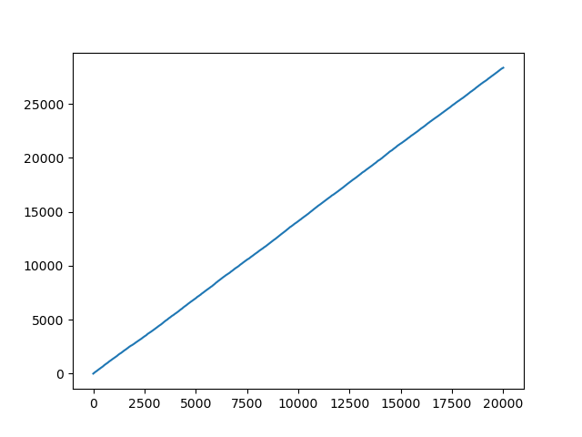
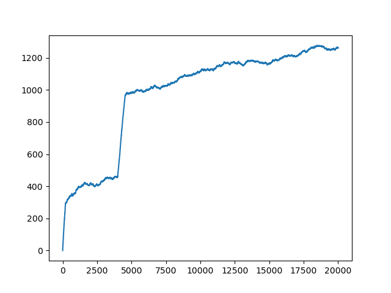
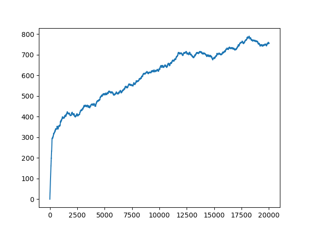
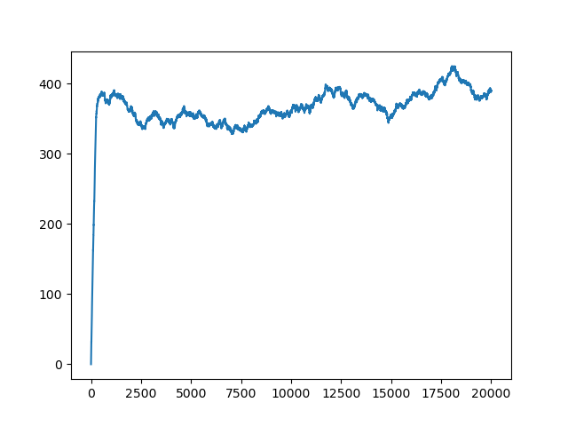
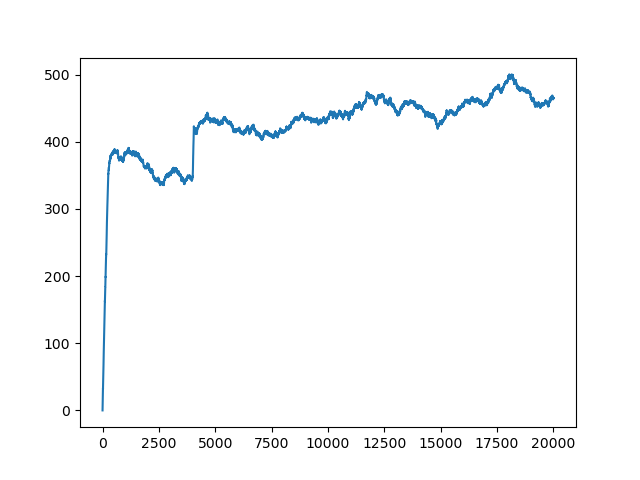

# Тензорные алгоритмы многоруких бандитов

# Описание реализации

## bandit.py

Представляет собой базовую версию многорукого бандита, который осуществляет взаимодействие со средой, параметры которой заранее заданы.

##### Параметры:

- reward_tesor - задаёт тензор наград, где каждая размерность отвечает за определенный объект выбора

- noise_level - уровень шума, который добавляется для обучения алгоритма в уловиях, приближенных к реальности

- log (по умолчанию False) - при значении True выводит последовательность действий бандитов.

##### Методы:

- PlayArm - принимает на вход номер ручки в виде многомерного индекса (index), осуществляет сэмплирование награды из парметров среды, сохраняет regret

- UpdateArm - принимает номер ручки в аналогичном PlayArm формате, а также delta. В среде увеличивает базовую награду данной ручки на delta.

- PlotRegret - сохраняет график regret в файл с заданным именем (принимает как аргумент)

## funcs.py

- L_inf_norm - считает $l_1$-норму тензора

- prod - считает произведение всех элементов любой спископодобной структуры

- marginal_multiplication - считает тензорное произведение, определенное в статье https://arxiv.org/pdf/2007.15788.pdf на странице 9.

## tensor.py

Содержит необходимые классы и функции для операции дополнения тензора. Код был взят из репозитория https://github.com/datamllab/pyten и переписан на Python 3 (оригинальный код на Python 2).

## random.py

##### Параметры:

Реализация алгоритма многоруких бандитов, который на каждом шаге выбирает произвольную ручку, не основывясь на истории действий.

- dimensions -размерность тензора наград среды 
- bandit - объект класса **TensorBandit**, который отвечает за взаимодействие со средой
- total_steps (по умолчанию 20000) - общее число шагов, доступных алгоритму
- img_name (по умолчанию None, то есть изображение не будет сохранено) - путь к файлу для сохранения графика regret
- update_arm_on_step (по умолчанию None) - номер шага, на котором происходит обновление ручек, правила можно изменить внутри кода
- delete_arm_on_step (по умолчанию None) - номер шага, на котором происходит удаление некоторых ручек, правила можно изменить внутри кода

##### Методы:

- Step - в качестве аргумента получает многомерный индекс ручки, которую играет (передает среде и получает награду)

- UpdateArms - обновляет все ручки, связанные с параметном выбора, который соответствует размерности `dim` и имеет в ней номер `ind`. Увеличивает базовый ревард соответствующих ручек на `delta`.

- DeleteArms - удаляет из рассмотрения ручки, связанные с параметном выбора, который соответствует размерности `dim` и имеет в ней номер `ind`.

- PlayAlgo - запускает весь алгоритм.

## ucb.py

##### Параметры:

Реализация алгоритма многоруких бандитов, который представляет собой векторное обобщение алгоритма UCB. На каждом шаге (после фазы исследования) он выбирает ручку с наибольшим значением верхней границы доверительного интервала, после чего обновляет интервал на основании полученных данных.

- dimensions -размерность тензора наград среды 
- bandit - объект класса **TensorBandit**, который отвечает за взаимодействие со средой
- total_steps (по умолчанию 20000) - общее число шагов, доступных алгоритму
- explore_steps (по умолчанию 200) - количество шагов в фазе исследования (когда алгоритм играет произвольные ручки, чтобы изучить среду).
- img_name (по умолчанию None, то есть изображение не будет сохранено) - путь к файлу для сохранения графика regret
- update_arm_on_step (по умолчанию None) - номер шага, на котором происходит обновление ручек, правила можно изменить внутри кода
- delete_arm_on_step (по умолчанию None) - номер шага, на котором происходит удаление некоторых ручек, правила можно изменить внутри кода

##### Методы:

- Step - в качестве аргумента получает многомерный индекс ручки, которую играет (передает среде и получает награду). Обновляет необходимые алгоритму статистики.

- UpdateArms - обновляет все ручки, связанные с параметном выбора, который соответствует размерности `dim` и имеет в ней номер `ind`. Увеличивает базовый ревард соответствующих ручек на `delta`.

- DeleteArms - удаляет из рассмотрения ручки, связанные с параметном выбора, который соответствует размерности `dim` и имеет в ней номер `ind`.

- FindBestCurrArm - на основании собранных к текущему шагу статистик рассчитывает доверительные интервалы и выбирает ручку с максимальной границей.

- PlayAlgo - запускает весь алгоритм.

## elimination.py

##### Параметры:

Реализация Elimination алгоритма многоруких бандитов, описанного в статье https://arxiv.org/pdf/2007.15788.pdf Основная идея алгоритма в том, чтобы постепенно сужать множество рассматриваемых ручек исходя из построение доверительного интервала для возможной награды. В данном случае для оптимизации алгоритм производит оценку не с помощью рассмотрения всех вариантов, а с предположением о ранге тензора наград и используя операцию тензорного дополнения. 

- dimensions -размерность тензора наград среды 
- ranks - предполагаемый ранг тензора наград среды
- bandit - объект класса **TensorBandit**, который отвечает за взаимодействие со средой
- total_steps (по умолчанию 20000) - общее число шагов, доступных алгоритму
- explore_steps (по умолчанию 200) - количество шагов в фазе исследования (когда алгоритм играет произвольные ручки, чтобы изучить среду).
- lambda1 (по умолчанию 0.01) - параметр регуляризации алгоритма (подробнее в статье)
- lambda2 (по умолчанию 20.0) - параметр регуляризации алгоритма (подробнее в статье)
- conf_int_len (по умолчанию 0.3) - длина доверительных интервалов, которые используются в оценке (подробнее в статье)
- img_name (по умолчанию None, то есть изображение не будет сохранено) - путь к файлу для сохранения графика regret
- update_arm_on_step (по умолчанию None) - номер шага, на котором происходит обновление ручек, правила можно изменить внутри кода
- delete_arm_on_step (по умолчанию None) - номер шага, на котором происходит удаление некоторых ручек, правила можно изменить внутри кода

##### Методы:

- Step - в качестве аргумента получает многомерный индекс ручки, которую играет (передает среде и получает награду). Обновляет необходимые алгоритму статистики.

- CreateArmTensorByIndex - вспомогательный метод, который позволяет из многомерного индекса ручки получить тензор, где на соответствующей позиции стоит 1, а на остальных - 0. 

- UpdateArms - обновляет все ручки, связанные с параметном выбора, который соответствует размерности `dim` и имеет в ней номер `ind`. Увеличивает базовый ревард соответствующих ручек на `delta`.

- DeleteArms - удаляет из рассмотрения ручки, связанные с параметном выбора, который соответствует размерности `dim` и имеет в ней номер `ind`.

- FindBestCurrArm - на основании собранных к текущему шагу статистик находит наилучшую ручку согласно алгоритму.

- UpdateEstimation - вызывается каждые 50 (можно изменить в коде) шагов, производит обновление некоторых статистик, которые требуют более длительного времени (обновление разложения таккера и новое тензорное дополнение).

- FindBestBeta - вспомогательный метод, который помогает найти нужный коэффициент для последующей оценки.

- PlayAlgo - запускает весь алгоритм.

# Сравнение алгоритмов в заданной конфигурации:

| random | ucb | elimination |
|:-:|:-:|:-:|
|  |  |  |

## With update on 4000

| random | ucb | elimination |
|:-:|:-:|:-:|
|  |  |  |

## With delete on 6000

| random | ucb | elimination |
|:-:|:-:|:-:|
|  |  |  |

## With both update on 4000 and delete on 6000

| random | ucb | elimination |
|:-:|:-:|:-:|
|  |  |  |

# Итоги: 
во всех рассмотренных конфигурациях алгоритм **elimination** показал себя лучше остальных по показателю regret. Более того, влияение обновления ручек на него было заметно меньше, чем на алгоритм ucb.

Стоит также заметить, что как elimination, так и ucb достаточно быстро справились с определением оптимальной ручки (регрет выходит на плато и дальнейшие изменения просиходят только из-за шума). При дальнейшем более точном подборе параметров для каждого из алгоритмов, вероятно, должно получится добится ещё более лучших результатов.